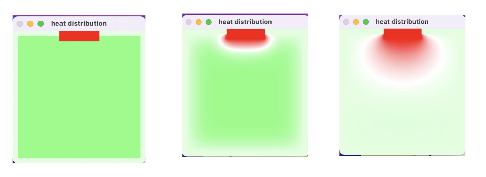

# HEAT-SIMULATION

Designed a heat simulation in C++ using **OpenCV matrices** and the **Jacobi method** to simulate temperature changes in a classroom.

Make sure OpenCV is properly installed and configured before compiling.

## Compile

```bash
g++ simulation.cpp \
-I/opt/homebrew/opt/opencv/include/opencv4 \
-L/opt/homebrew/opt/opencv/lib \
-lopencv_core -lopencv_highgui -lopencv_imgproc \
-o simulation


To run:
./simulation 100 75 1e-3 top 
```

## Heat-simulation output:




